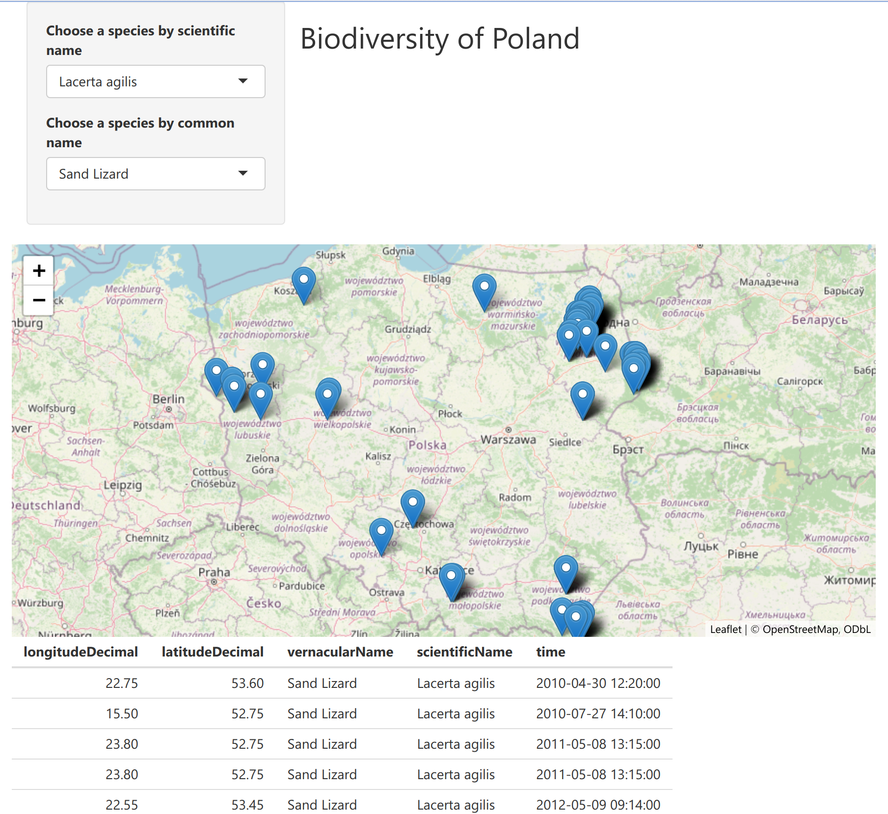

# Biodiversity of Poland
This R Shiny application displays the locations of species images captured in Poland. Simply select either the common name or the scientific name of a species from the provided lists, and the corresponding locations will be highlighted on the map.

[Biodiversity on shinyapps.io](https://khharut.shinyapps.io/biodiversity/)

# Application screenshot
